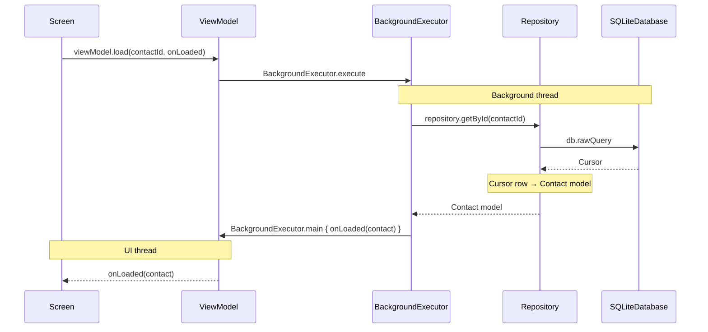

# Database

This app stores its data in a local SQLite database through the framework's `SQLiteOpenHelper`.   
[Room](https://developer.android.com/training/data-storage/room) is not used because external libraries are not allowed.

## Schema

**SQLite** has no server. The whole database is a single file on the device, stored in the app's private storage at `/data/data/com.ysengoku.ft_hangouts/databases/ft_hangouts.db`. Only this app can read it, so there is no user, password or connection string.   

The database has two tables in this project:

### contacts

| Column | Type | Null | Notes |
|---|---|---|---|
| `id` | INTEGER | No | Primary key, auto increment |
| `first_name` | TEXT | No | |
| `last_name` | TEXT | Yes | |
| `company` | TEXT | Yes | |
| `phone` | TEXT | No | E.164 format (e.g.  `+33612345678`) |
| `phone_country` | TEXT | No | ISO 3166 region code chosen in the form (e.g. `FR`) |
| `address` | TEXT | Yes | |
| `birthday` | TEXT | Yes | ISO 8601 date (e.g. `1995-04-12`) |
| `note` | TEXT | Yes | |
| `picture` | TEXT | Yes | URI of the picture |

`phone` is the only value used to send and match SMS. `phone_country` is only used to restore the country in the edit form, because one calling code can belong to several countries (`+1` is used by the US and Canada).

### messages

| Column | Type | Null | Notes |
|---|---|---|---|
| `id` | INTEGER | No | Primary key, auto increment |
| `contact_id` | INTEGER | No | Foreign key to `contacts.id`, `ON DELETE CASCADE` |
| `is_incoming` | INTEGER | No | `1` for received, `0` for sent |
| `created_at` | INTEGER | No | Unix time in milliseconds |
| `content` | TEXT | No | |

Deleting a contact also deletes its messages. Foreign keys are off by default in SQLite, so `DatabaseHelper.onConfigure` turns them on.

## Data flow

Screens never touch the database. They ask a ViewModel, which runs the repository call on a background thread and passes the result back on the UI thread.

Example: the contact detail screen loads one contact.



Other screens follow the same pattern with other repository calls.

### Threading (Executors)

`BackgroundExecutor` has one background thread shared by all database calls, so queries never run on the UI thread and never run at the same time. `BackgroundExecutor.main` posts the result back to the UI thread.

### Repository

`ContactRepository` and `MessageRepository` run the SQL and map rows to models.

| Model | Used for |
|---|---|
| `Contact` | One contact with all columns (detail and form screens) |
| `ContactSummary` | The columns needed by the contact list only (`id`, names, `picture`) |
| `Message` | One message |

The repository also converts types that SQLite does not have: `birthday` TEXT ↔ `LocalDate`, and `is_incoming` INTEGER ↔ `Boolean`.

Lists are loaded page by page with `LIMIT` and `OFFSET`.

### Cursor

A `Cursor` is the result of a query. It does not hold a list of objects. It points to one row at a time, and the repository moves it forward to read the rows one by one:

1. `moveToNext()` moves to the next row. It returns `false` when there are no more rows.
2. `getColumnIndexOrThrow("first_name")` finds the index of a column.
3. `getString(index)`, `getLong(index)` and so on read the value of that column in the current row.

A `Cursor` keeps resources open until it is closed, so the repository always reads it inside `cursor.use { }`, which closes it automatically.

The framework `Cursor` has no method for a nullable TEXT column, so the app adds `Cursor.getStringOrNull` (`CursorExtensions.kt`).

### DatabaseHelper

Owns the database file. It creates the tables (`onCreate`), turns on foreign keys (`onConfigure`), runs migrations (`onUpgrade`), and gives the open `SQLiteDatabase` to the repositories. It does not run queries itself.   
One instance is shared by the whole app (`DatabaseHelper.getInstance`).

## Versioning

`DATABASE_VERSION` stays at `1` during development. Schema changes are made directly in the `CREATE TABLE` statements, and the local database is reset (see [Reset](#reset)).

After the first release, every schema change must:

1. Increase `DATABASE_VERSION`.
2. Update the `CREATE TABLE` statement, for new installs (`onCreate`).
3. Add a step in `onUpgrade`, for existing installs, for example `if (oldVersion < 2) { db.execSQL("ALTER TABLE contacts ADD COLUMN email TEXT") }`.

Both paths must end with the same schema.

## Development tools

### Seeding

Fill the database with demo data (12 contacts, 25 messages with the first contact):

```bash
# From the project root
./tools/seed.sh
```

Requirements:

1. A debug build (the script uses `run-as`).
2. The app has been launched once, so the database exists.
3. `sqlite3` on the device (available on the emulator).

The script deletes all rows before inserting, so it can be run many times.

### Reset

```bash
adb shell pm clear com.ysengoku.ft_hangouts
```

This deletes all app data, including the selected theme. Launch the app again to create an empty database.

### Inspecting the database

In Android Studio: **View → Tool Windows → App Inspection → Database Inspector**.

From a terminal, pass any SQL query as the last argument. For example, to list all contacts:
```bash
adb shell run-as com.ysengoku.ft_hangouts sqlite3 -header -column databases/ft_hangouts.db \
  "SELECT * FROM contacts;"
```
