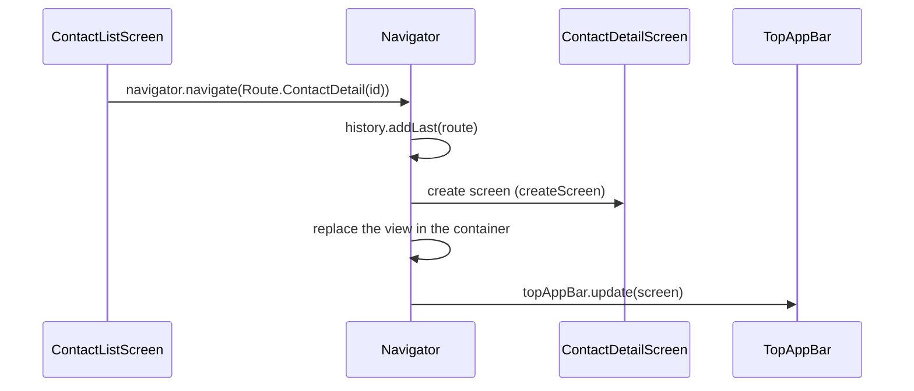
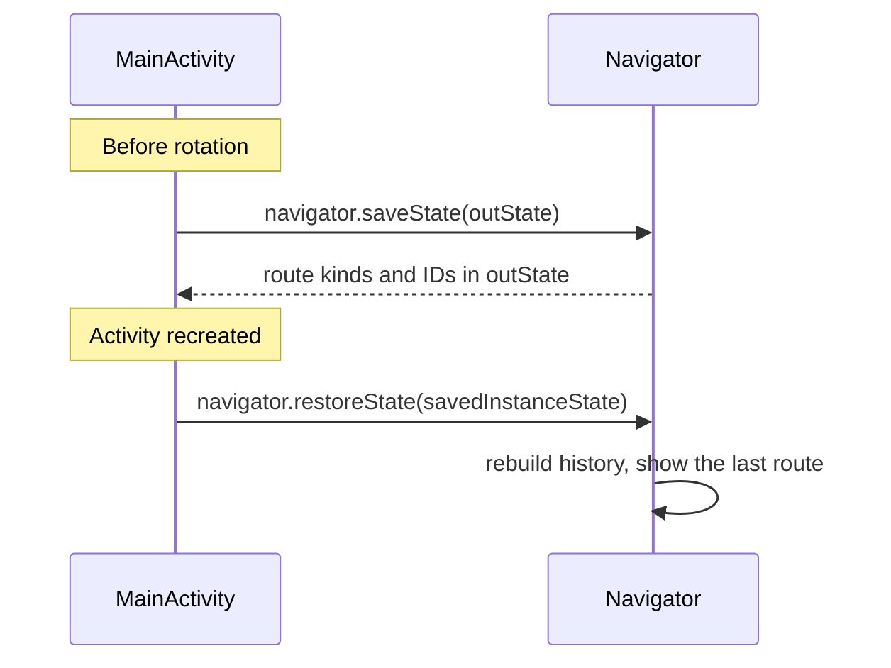

# Navigation

The app has one Activity (`MainActivity`) and its own `Navigator`, which swaps screens inside it. Screens are plain classes that own a `View`.

## Overview

| Part | Role |
|---|---|
| `MainActivity` | Holds the top app bar and the screen container. Creates the `Navigator` and forwards Activity events to it. |
| `Navigator` | Keeps the history of routes, creates the screen for a route, and puts its view in the container. |
| `Route` | Says which screen to show and with which ID. |
| `Screen` | One screen. Owns its view and declares how the top app bar should look. |
| `TopAppBar` | The app bar shared by all screens. Updated by the `Navigator` each time the screen changes. |

Example: the user taps a contact in the list.

## Routes and back stack

| Route | Screen |
|---|---|
| `ContactList` | Contact list (home) |
| `ContactDetail(contactId)` | Contact detail |
| `Conversation(contactId)` | Messages with one contact |
| `ContactForm(contactId)` | New contact when `contactId` is `null`, edit otherwise |

A route only carries a contact ID, never a whole `Contact`. Each screen loads its data from the database, so it always shows the latest values, and a route can be saved in a `Bundle` as plain values when the Activity is recreated.

The history is an `ArrayDeque<Route>`. The last route is the screen on display.

| Call | History | Result |
|---|---|---|
| `start()` | `[ContactList]` | Shows the home screen |
| `navigate(route)` | Adds `route` at the end | Shows the new screen |
| `back()` | Removes the last route | Shows the previous screen. Returns `false` on the home screen |

Going back creates the previous screen again from its route. The screen reloads its data, so changes made on later screens (edit, delete) are visible. The scroll position is not kept.

## Screens

Each screen implements the `Screen` interface:

| Property | Meaning |
|---|---|
| `view` | The screen's root view, added to the container by the `Navigator` |
| `title` | App bar title. An empty string hides the text but keeps the space |
| `navigationIcon` | Left button of the app bar: `NONE`, `BACK` or `CLOSE` |
| `action` | Right button of the app bar (icon, label, click handler), or `null` |

A screen only declares these values. The `Navigator` passes the screen to `TopAppBar.update`, which applies them. A screen that learns its title later (for example after loading a contact) calls `navigator.setTitle`.

Screens receive the `Navigator` in their constructor and call `navigate` or `back` to move to another screen.

Optional hooks `saveState` and `onActivityResult` are forwarded by the `Navigator` to the screen on display. Only the [contact form](CONTACT_FORM.md) uses them.

## Configuration changes

**Rotating the device** or **changing the theme** destroys and recreates `MainActivity`. A new `Navigator` is created with an empty history, so without extra work the app would always return to the home screen.

To avoid this, the history is saved in the `Bundle` that Android passes to the new Activity:

A `Bundle` is a key-value store for small values, similar to `sessionStorage` on the web.   
It cannot store a `Route` object, so each route is converted to a pair of a kind (`"list"`, `"detail"`, `"conversation"`, `"form"`) and an ID (`-1` when there is no ID). The kinds and the IDs are saved as two arrays (`Route.toPair` and `routeOf`).

In `onCreate`, `savedInstanceState` is `null` on a normal start, so the app calls `navigator.start()`. Otherwise it calls `navigator.restoreState(savedInstanceState)`.

The views are not saved. Each screen is created again and reloads its data. Android restores the text of `EditText` views that have an ID, because the screen views are added during `onCreate`.
